#### 参照忧郁的弟弟网页建立的网站
##### 整体采用bootstrap样式，包含大量动效

## <1>主页面
#### 1.点开网站的显示效果
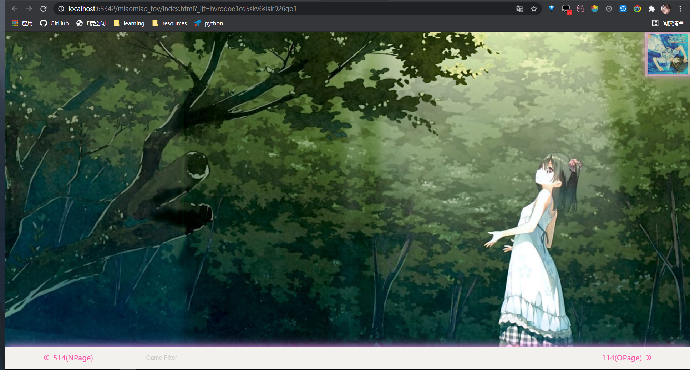

#### 2.鼠标移到右上角有音乐盒的div浮出，点开可以播放音乐：
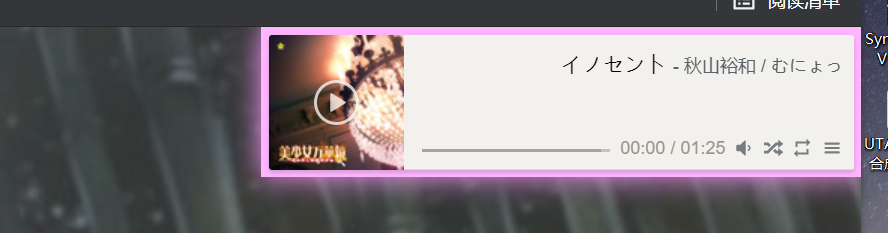 

#### 3.将鼠标移到页脚处，最下面的div会上浮显示内容：
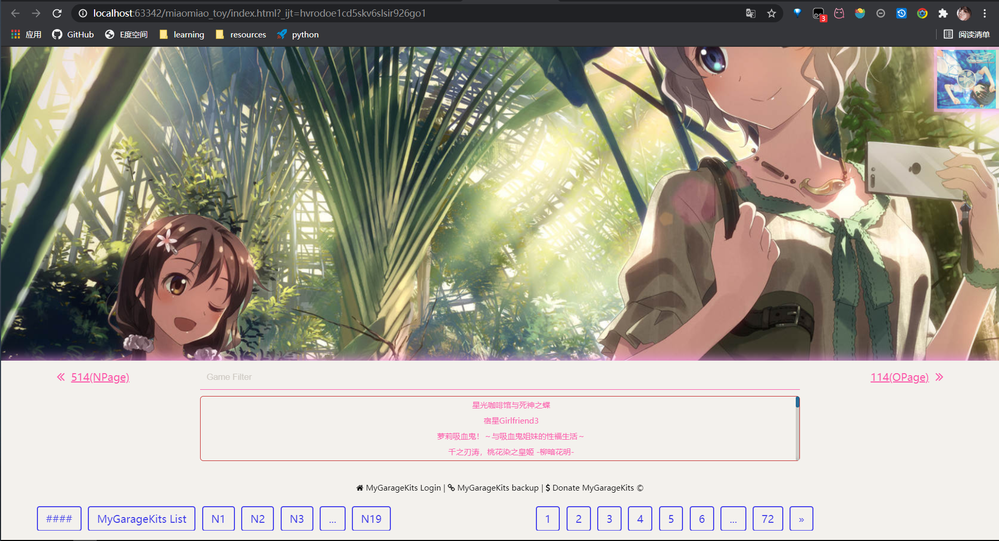 

## <2>列表页
#### 展示效果
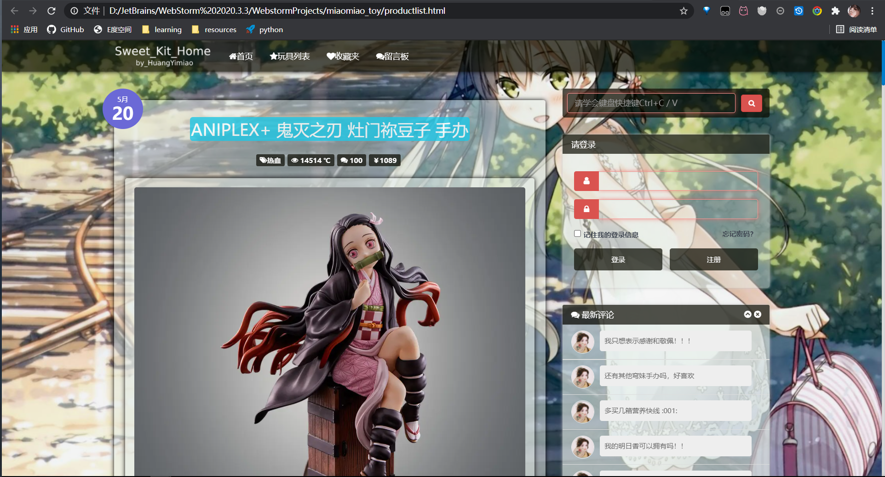 
 
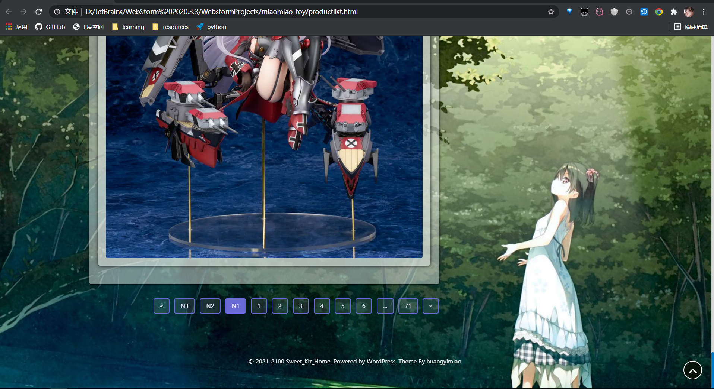 

#### 可以根据网页自适应改变显示模式
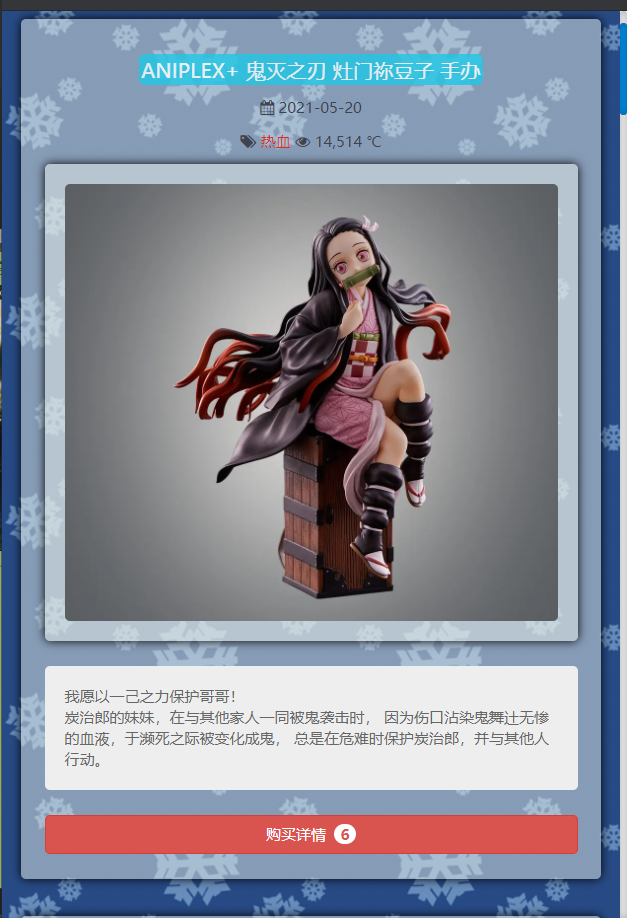 

## <3>详情页
#### 展示效果
 
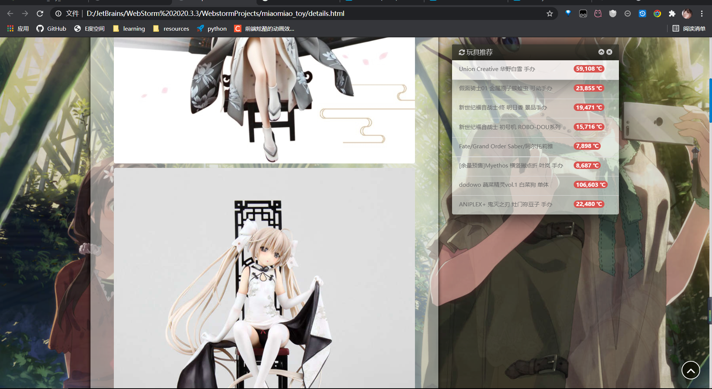 
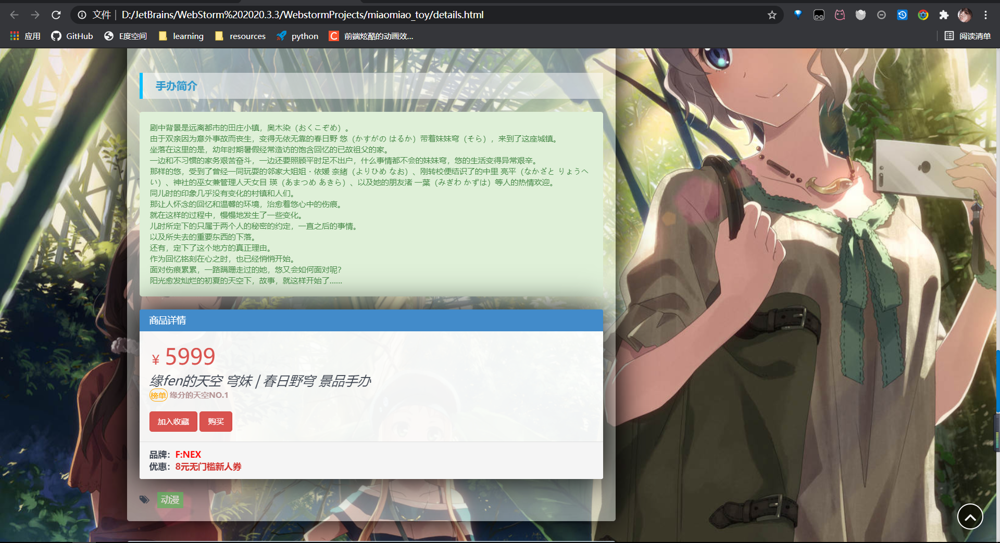 
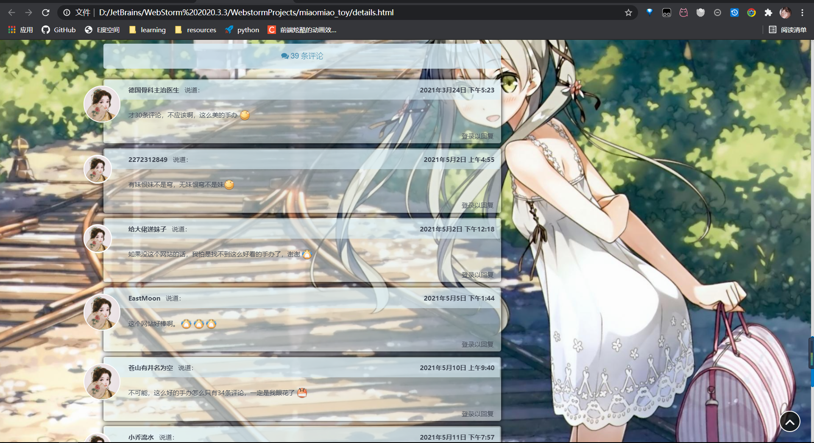 
 

#### 同样可以根据网页自适应改变显示模式

## <4>收藏列表
#### 展示效果
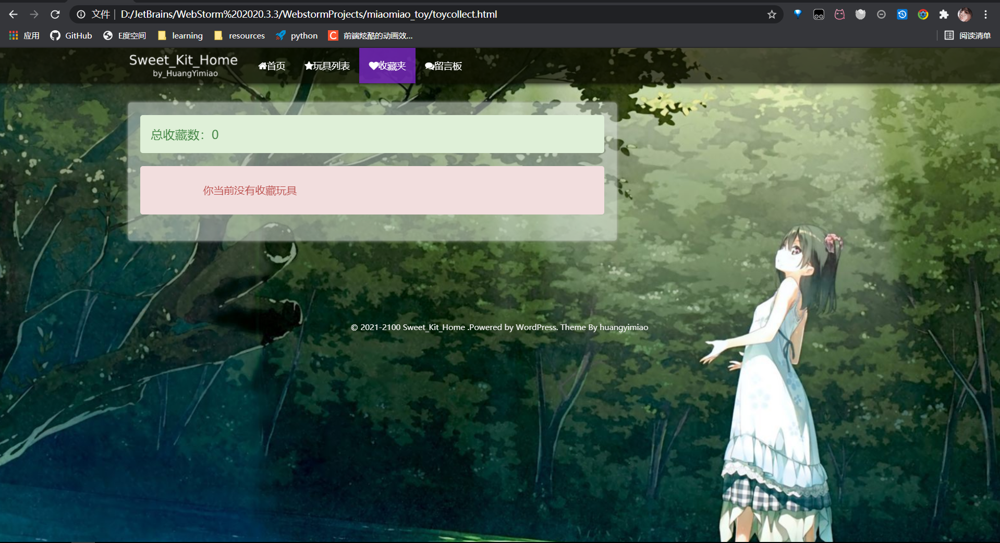 

## <5>留言列表
#### 展示效果
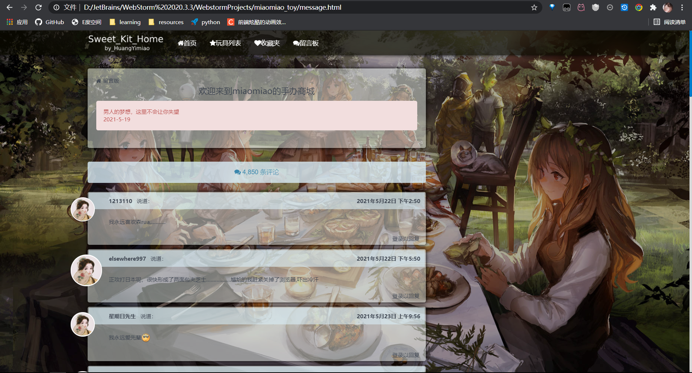 
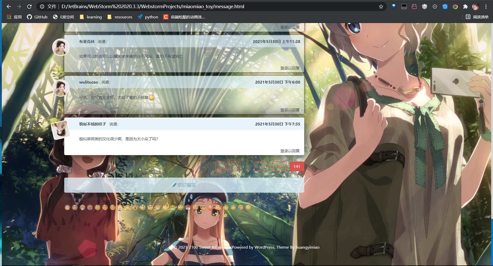 

个人邮箱：<huangyimiao666@gmail.com>
